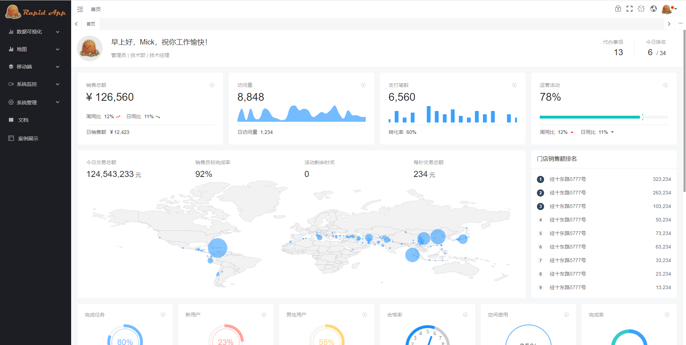

# Rapid App

企业级应用快速开发基础框架，内置角色、权限管理，日志管理、数据可视化图表等常用功能，前后端均选用热门的前沿技术，有上手简单，开发效率高效等优点，适合企业级中小型项目的快速开发。

## 特性

- 内置丰富的图表库，简化数据可视化界面开发
- 支持 RTMP 转 HLS，内置 MP4、HLS 播放器
- 二三维地图开发：封装了 Leaflet、Openlayers、Cesium 等组件，简化二三维地图开发
- 支持 obj、Gltf 等格式的三维模型加载、展示
- 自动收集前后端错误日志
- 用户、角色、权限管理
- Redis 监控界面，实时监控 Redis 运行
- 集成 Hangfire
- 美化 Swagger UI 界面
- 支持主流数据库

## 技术框架

### 前端界面一

- 基于 Vue-cli Vue 2.6 vue-router vuex
- 组件库：View UI
- 图表：AntV

### 前端界面二

- 基于 UmiJS react 17
- 组件库：Ant Design Pro 5

### 服务端

- ASP.NET 5
- ORM：EntityFramework Core
- 日志：Serilog
- API 文档：Swagger UI
- 数据库支持：SQL Server、PostgreSQL、SQLite
